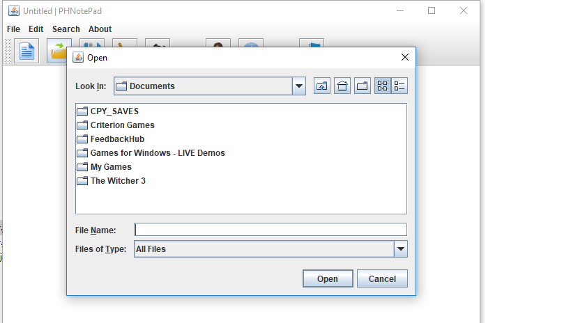
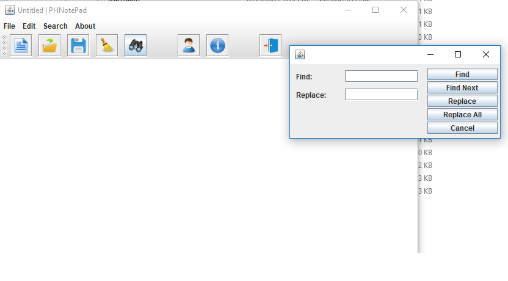

# java_editor
A basic text editor made in java

<h2> this is a project I made when I completed learning java.</h2> 

<h3> I just have used the GUI based java and some basic concept of OO programming.<h3>

 NOTE:- icons, menubar code, opening file code were copied from web.. <h3>stackoverflow..</h3> 

<h2> some inside pictures of the editor </h2>

 fileopening in the editor

 search dialog box  in the editor
